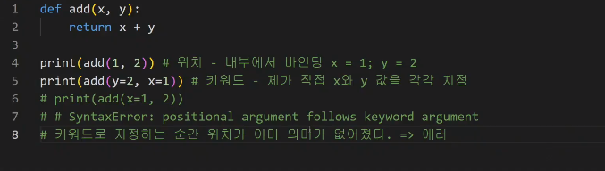
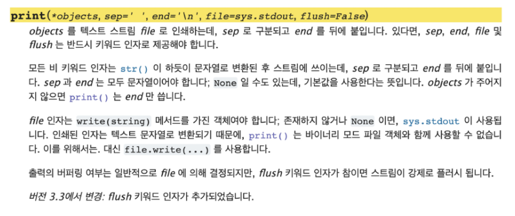

# ***< 함수 >***


## ✔  사용자 함수 ##

``` python
def function_name(parameter):
    return returning_value
```


## ✔  함수 기본구조

1. #### **선언과 호출(Define & Call)**

   - 함수의 선언은 def키워드를 활용함

   - 들여쓰기를 통해 Fuction body(실행될 코드 블록)를 작성함
     - Docstring은 함수 body앞에 선택적으로 작성 가능
       - 작성시에는 반드시 첫 번째 문장에 문자열 `" "`

   - 함수는 parameter를 넘겨줄 수 있음

   - 함수는 동작 후에 return을 통해 결과값을 전달함

     

   #### <  Example  >

   - 입력 받은 수를 세제곱하여 반환하는 함수 cube를 작성하시오. (정의)
   - 함수 cube를 활용하여 2의 세제곱, 100의 세제곱을 구하시오. (호출)

```python
#숫자를 받아서 (input)
#세제곱 결과를 반환 (output)
#호출 : cube(2), cube(10), cube(100)
def cube(number):
    return number * number * number

print (cube(2))
print (cube(10))
print (cube(100))
```

---


2. #### **입력(Input)**

   - *Argument* `func_name(argument)` : 함수 호출 시 함수의 parameter를 통해 전달되는 값 

     - 필수 Argument : 반드시 전달되어야 하는 argument

     - 선택 Argument : 값을 전달하지 않아도 되는 경우는 기본 값이 전달

     - 기본적으로 함수 호출 시 Argument는 위치에 따라 함수 내에 전달됨

     - *Keyword Argument* : ((호출)) 직접 변수 이름으로 특정 Argument를 전달할 수 있음 

       ​	(⁂Keyword Argument 다음에 Positional Argument를 활용할 수 없음)

       

     - *Default Arguments Values* : ((정의)) 기본값을 지정하여 함수 호출 시 argument 값을 설정하지 않도록 함 

       - 정의된 것보다 더 적은 개수의 argument들로 호출 될 수 있음

     - 정해지지 않은 여러 개의 Arguments 처리 

       

       

     - *Positional Argumetns Packing/Unpacking* 연산자 (*) : 몇 개의 Poistional Argument를 받을지 모를는 함수를 정의할 때 유용

     ```python
     def add(*args):
     	print(args, type(args))
     
     add(1, 2, 3)
     #(1, 2, 3), <class 'tuple'>
     ```

     - *Keyword Arguments Packing/Unpacking(**)* : 딕셔너리로 묶여 처리되며, parameter에 `**`를 붙여 표현

     ```python
     def family(**kwargs):
         for key, value in kwargs:
             print(key, ":", value)
     family(father='John', mother='Jane', me='John Jr.')
     ```

     - 함수 정의 주의 사항

       - 기본 argument 값을 가지는 argument 다음에 기본 값이 없는 argumetn로 정의 할 수 없음

         `def greeting(name = 'john doe', age) : ` > 정의 불가

         

         

          

3. #### **결과값(Output)**

   - *Void function*
     - 명시적인 return 값이 없는 경우, None을 반환하고 종료

   - *Value returning fuction*

     - 함수 실행 후, retrun문을 통해 값 반환

     - return을 하게 되면, 값 반환 후 함수가 바로 종료

       ```python
       # Void function
       print('hello python')
       
       #Value returning function > 쥬피터 실행시 Out 표시
       float('3.14')
       ```

     - 함수는 항상 단일한 값만을 반환

       - 두개 이상의 값 반환하기 위해서는 튜플 반환 사용

         ```python
         def minus_and_product(x,y):
         	return x-y, x*y
         ```

       - <u>***return vs print***</u>

         - return은 함수 안에서만 사용되는 키워드
         - print는 출력을 위해 사용되는 함수
         - REPL(Read-Eval-Pring Loop)환경에서는 마지막으로 작성된 코드의 리턴값을 보여줌

         

     #### < Example >

     - 너비와 높이를 입력 받아 사각형의 넓이와 둘레를 튜플로 반환하는 함수 rectangle을 작성하시오.
     - 함수 rectangle을 활용하여 가로 30 세로 20 사각형의 널입와 둘레를 구하시오.

     ```python
     def rectanle(width, height):
         return width * height, (width + height) * 2
     
     print(rectangle(30,20))
     ```

---


4. #### **범위(Scope)**

   - 함수는 코드 내부에 local scope를 생성하며, 그 외의 공간인 global scope로 구분

   - <u>*scope*</u>
     - global scope : 코드 어디에서든 참조할 수 있는 공간
     - local scope : 함수가 만든 scope. 함수 내부에서만 참조 가능variable

   - <u>*variable*</u>

     - global variable : global srope에 정의된 변수
     - local variable : local scope에 정의된 변수

   - 변수 수명주기(lifecycle)

     - built-in scope : 영원히 유지
     - global scope : 모듈이 호출된 시점 이후 혹은 인터프리터가 끝날 때까지 유지
     - local scope : 함수가 호출될 때 생성되고, 함수가 종료될 떄까지 유지

     ```python
     def func():
         a = 20
         print('local', a)
     #local 20
     fucn()
     print('global', a)
     #에러
     #a는 Local scope에서만 존재
     ```

     

   - 이름 검색 규칙(Name Resolution) : *<u>**LEGB Rule**</u>*

     - *Local scope* : 함수

     - *Enclosed scope* : 특정 함수의 상위 함수

     - *Global scope* : 함수 밖의 변수, Import 모듈

     - *Built-in scope* : 파이썬 안에 내장되어 있는 함수 또는 속성

       ​	(⁂함수 내에서는 바깥 scope의 변수에 접근가능하나 수정은 할 수 없음)

     ```python
     a = 0
     b = 1
     def enclosed():
         a = 10
         c = 3
         def local(c):
             a = 10
             c = 3
             def local(c):
                 print(a, b, c)
             local(300)
             print(a, b, c)
      enclosed()
     print(a, b)
     # 10 1 300
     # 10 1 3
     # 0 1
     ```
   
     
   
   - *global* : 현재 코드 블록 전체에 적용되며, 나열된 식별자(이름)이 global variable임을 나타냄
   
     - global에 나열된 이름은 같은 코드 블록에서 global 앞에 등장할 수 없음
     - global에 나열된 이름은 parameter, for 루프 대상, 클래스/함수 정의 등올 정의되지 않아야 함
     - 상단에 global 먼저 제시
   
     ```python
     a = 10
     def func1() :
         global a
         a = 3
         
     print(a)
     func1()
     print(a)
     #10
     #3
     ```
   
     
   
   - *nonlocal* : global을 제외하고 가장 가까운 scope의 변수를 연결하도록 함
   
     - nonlocal에 나열된 이름은 같은 코드 브록에서 nonlocal 앞에 등장할 수 없음
     - nonlocal에 나열된 이름은 parameter, for 루프 대상, 클래스/함수 정의 등으로 정의되지 앟아야 함
     - global과 달리 이미 존재하는 이름과의 연결만 가능함
   
     ```python
     x = 0
     def func():
         x = 1
         def func2():
             nonlocal x
             x = 2
         func2()
         print(x)
     fucn1()
     print(x)
     ```
   
   
   
   
   - ***<u>주의</u>***
     - 기본적으로 함수에 선언되는 변수는 Local scope에 생성되며, 함수 종료 시 사라짐
     - 해당 scope에 변수가 없는 경우 LEGB rule에 의해 이름을 검색함
       - 변수에 접근은 가능, but 해당 변수 수정 불가
       - 함수 내에서 필요한 상위 socpe 변수는 argument로 넘겨서 활용할 것 (클로저 제외)
     - 상위 scope에 있는 변수를 수정하고 싶다면 global, nonlocal 키워드를 활용 가능
       - But, 코드가 복잡해지고 오류 발생 >> *함수로 값을 바꾸고자 하면 argument로 넘기고 리턴 값을 사용*
   
   - ***<u>globals()와 locals()</u>*** >> 범위 확인하기
     - namespace(global, local, builtin) 을 딕셔너리(dict)으로 정리
       - locals() : locals()가 실행되어지는 함수 내의 local namespace 들을 정리
       - globals() : global, local, builtin 정보 모두 dict 형태로 정리
   
   ---


5. #### **함수의 문서화(Doc-String)**

   - 함수나 클래스의 설명
   - Jupyter notebook에서 함수에 커서를 놓고 shift + tab
   - 상수 이름은 영문 전체를 대문자
   - 클래스 및 예외의 이름은 각 단어의 첫 글자만 영문 대문자
   - 이외 나머지는 소문자 또는 밑줄로 구분한 소문자 > 함수
   - Naming Convention
     -  함수 이름만으로 어떤 역할 함수인지 파악 가능
     - 어떤 기능 수행하는지, 결과 값으로 무엇을 반환 하는지
     - 무분별한 약어는 지양

   ---

   

6. #### **함수 응용**

   - ***map (function, iterable)***

     - 순회 가능한 데이터구조의 모든 요소에 함수 적용 > 결과를 map object 로 반환

     ```python
     n, m = map(int, input().split())
     # 3 10
     print(n, m)
     print(type(n), type(m))
     # 3, 10
     # <class 'int'> <class 'int'>
     ```

   - ***filter (function, iterable)***

     - 순회 가능한 데이터구조의 모든 요소에 함수 적용 > Ture만 filter object로 반환

     ```python
     def odd(n):
     	return n % 2
     numbers = [1, 2, 3]
     result = filter(odd, numbers)
     print(result, type(result))
     # <filter object at 0x10e4dfc10> <class 'filter'>
     list(result)
     # [1, 3]
     ```

   - ***zip (`*`iterables)***

     -  복수의 iterable을 모아 튜플을 원소로 하는 zip object를 반환

     ```python
     girls = ['jane', 'ash']
     boys = ['justin', 'eric']
     pair = zip(girls, boys)
     print(pair, type(pair))
     #<zip object at 0x10e500c80< <class 'zip'>
     list(pair)
     #[('jane', 'justin'), ('ash', 'eric')]
     
     # 람다함수
     '''
     def odd(n):
         return n % 2
     print(list(filter(odd, tange(5))))
     '''
     print(list(filter(lambda n : n % 2, range(5))))
     ```

   - ***lambda*** 

     - 표현식을 계산한 결과값을 반환 > 익명함수
     - return문을 가질 수 없음
     - 간편 조건문만 가능 > def 사용 안해도 됨

     ```python
     # 삼각형의 넓이 구하는 공식 - def
     def triangle_area(b,h):
     	return 0.5 * b * h
     triangle_area(5, 6)
     # 15.0
     
     # 삼각형의 넓이 구하는 공식 - 람다
     triangle_area = lambda b, h : 0.5 * b * h
     triangle_area(5, 6)
     # 15.0
     ```

   - ***재귀함수***

     - 자기 자신을 호출하는 함수
     - 1개 이상의 base case(종료되는 상황)가 존재하고, 수렴하도록 작성
     - 최대 재귀 깊이가 1,000번으로, 호출 횟수가 이를 넘어가게 되면 Recursion Error 발생

     ```python
     def factorial(n):
     	if n == 0 or n == 1:
     		return 1
     	else:
     		return n * factorial(n-1) #재귀함수 사용
     factorial(4)
     #24
     ```

     - 반복문으로 표현

     ```python
     def fact(n):
     	result = 1
     	while n > 1:
     		result *= n
     		n -= 1
     	return result
     ```

     - 알고리즘에선 재귀적인 표현이 자연스러움
     - 재귀 호출은 변수 사용을 줄여줄 수 있음
     - 재귀 호출은 값이 커질수록 연산 속도가 오래걸림


